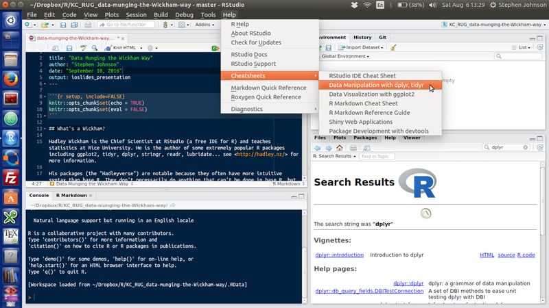
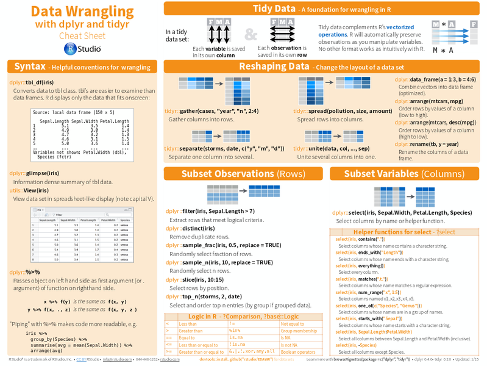

```{r setup, include=FALSE}
knitr::opts_chunk$set(echo = TRUE)
knitr::opts_chunk$set(eval = TRUE)
knitr::opts_chunk$set(message = TRUE)
knitr::opts_chunk$set(warning = FALSE)
```

## Overview
- What's a Wickham?
    + Introduction to the tidyverse
- Tidy vs. untidy data
- Tidying data with `tidyr`
- Manipulating data with `dplyr`
- Pipe syntax
- Where to get more information
- Download the code for this presentation
    + https://github.com/stephenjjohnson/KCRUG_tidyr_dplyr

## What's a Wickham?
- Hadley Wickham is the Chief Scientist at RStudio (a free IDE for R) and teaches statistics at Rice University. 
- He is the author of some extremely popular R packages including `ggplot2`, `tidyr`, `dplyr`, `stringr`, `readr`, `lubridate`... see <http://hadley.nz/> for more information.
- His packages (the "Hadleyverse" or "tidyverse") are notable because they often have more intuitive syntax than base R. 
    + They don't necessarily do anything that can't be done in base R, but they make for code that is simpler to write and easier to understand.  


## Let's get started
- We're going to be using the `tidyr` and `dplyr` packages
- Let's load them so they are available in the environment

```{r, eval = TRUE, message=TRUE}
# install.packages("tidyr", "dplyr")
library(tidyr)
library(dplyr)
```

## Wait! What were those messages about?

- The output is a warning that `dplyr` supersedes some of the function names in base R. 
- I like to be extra careful and call functions that might get confused using `::` notation. That way, if I see `dplyr::filter()`, I know that I intended to use dplyr and not base R `filter()`
- This syntax can also be used to call a particular function from a package without loading the whole package.

## Tidy data
1. One column = one variable
1. One row = one observation
1. One table contains one type of data
    + I break this rule all the time!
1. If you use more than one table, they should all have a column that allows them to be linked  

- https://github.com/jtleek/datasharing
- http://vita.had.co.nz/papers/tidy-data.html

## What do untidy data look like?

```{r, echo = TRUE}
data(iris)
iris <- tbl_df(iris)
head(iris)
```
- `tbl_df()` is a `dplyr` function that converts a dataframe to a "tibble". This makes for tidier printing, etc.

## What do tidy data look like?

```{r, echo = FALSE}
# I'll explain this later. This is just for illustration.
iris$ObsNo <- row.names(iris)
tidy_iris <- iris %>%
        tidyr::gather(Measurement, Value, c(Petal.Length, Petal.Width, Sepal.Length, Sepal.Width))
```

```{r}
sample_n(tidy_iris, 7)
```

- I added an index vector to refer to individual measurements.
- `sample_n()` is a `dplyr` function -- used here instead of `head()`

## Tidying data with tidyr
- Four complementary operations
    + `gather()` to combine variables into key-value pairs
    + `spread()` to spread  key-value pairs across multiple columns  
    + `separate()` to turn one column into multiple columns
    + `unite()` to turn multiple columns into one

## tidyr::gather()
- Gathers columns into rows
```{r}
iris$ObsNo <- row.names(iris)
tidy_iris <- gather(iris, Measurement, Value, 
                    c(Petal.Length, Petal.Width, 
                      Sepal.Length, Sepal.Width))
head(tidy_iris)
```

## tidyr::spread()
- Spreads rows into columns, opposite of `gather()`
```{r}
untidy_iris <- spread(tidy_iris, Measurement, Value)
head(untidy_iris)
```

## tidyr::unite()
- Unites several columns into one
```{r}
myData <- unite(untidy_iris, Dimensions, 
                Petal.Length, Petal.Width, Sepal.Length, Sepal.Width,
                sep = "x")
head(myData, 4)
```
- Takes tidy data and makes it untidy but can be good for making index vectors

## tidyr::separate()
- Does the opposite of `unite()`; separates one column into several
```{r}
myData <- separate(myData, Dimensions, c("Petal.Length", 
        "Petal.Width", "Sepal.Length", "Sepal.Width"), sep = "x")
head(myData, 4)
```
- I use this more often than `gather()`

## dplyr: a grammar of data manipulation
- Five main verbs
    + `filter()` to extract rows
    + `select()` to subset columns
    + `arrange()` to sort data
    + `summarise()` to calculate means, etc.
    + `mutate()` to compute new columns


## dplyr::filter()
- Extracts rows according to logical criteria
```{r}
myData <- filter(iris, Petal.Length < 2)
sample_n(myData, 5, replace = FALSE)
```

## dplyr::select()
- Selects columns by name or helper functions
```{r}
myData <- select(iris, Species, contains("Petal"))
sample_n(myData, 5, replace = FALSE)
```

## dplyr::arrange()
- Sorts data on columns
```{r}
myData <- arrange(iris, desc(Petal.Length))
head(myData)
```

## dplyr::summarize()
- Summarizes data into a single row of values
```{r}
myData <- summarize(iris, 
                    avg = mean(Petal.Length), 
                    med = median(Petal.Length),
                    min = min(Petal.Length),
                    max = max(Petal.Length), 
                    sd  = sd(Petal.Length))
print(myData)
```

## dplyr::summarize_each()
- Applies a summary function to each column
```{r}
myData <- summarize_each(iris, funs(mean))
print(myData)
```

## dplyr::mutate()
- Computes new columns
```{r}
myData <- mutate(iris, Petal.Aspect = Petal.Width / Petal.Length)
myData <- select(myData, -starts_with("Sepal"))
sample_n(myData, 5, replace = FALSE)
```
- `transmute()` will return the new column and drop the original columns

## Other dplyr functions
- `group_by()`
- `slice()` to subset rows by position
- `distinct()` to remove duplicated rows
- `rename()` to rename columns
- `sample_n()` and `sample_frac()`
- Combine data sets with
    + `left_join()`, `right_join`, etc.
    + `bind_rows()`, `bind_cols()`

## Combining dplyr functions
```{r}
tidy_iris %>% 
        group_by(Measurement) %>%
        summarize( avg = mean(Value), 
                   med = median(Value),
                   min = min(Value),
                   max = max(Value), 
                   sd  = sd(Value))
```

## Pipe notation with %>%
- Piping the output of a function to the input of another is a common practice in Unix/GNU Linux, and can make for a more intuitive pathway through a task. 
- The `magrittr` package implements this in R. 
- Take whatever is on the left of the %>% and use it as the first input to the expression on the right.

```{r, eval = FALSE}
head(filter(select(iris, Species, Petal.Length), 
            Species == "setosa"))
```

is clearer when written:

```{r,  eval = FALSE}
iris %>% select(Species, Petal.Length) %>%
        filter(Species == "setosa") %>%
        head()
```


## Help?


or https://www.rstudio.com/resources/cheatsheets/

## Example cheatsheet


## What's new in the tidyverse?

- The packages that make up the tidyverse are installed together so often that Hadley has put together a metapackage to install them all in one command. Not surprisingly, it is called `tidyverse`.

- It is not on CRAN (it was only released this week) yet but you can install from Github with:

````
# install.packages("devtools")
devtools::install_github("hadley/tidyverse")
````

- Once installed, you can load packages individually or all at once using `library(tidyverse)`.

- See https://github.com/hadley/tidyverse for information


## Summary
- The tidyverse is a set of packages that share a common syntax
    + Easier to follow than some base R syntax that is a legacy from its S roots
    + Not intrinsically better than base R but I find it more intuitive
- `tidyr` provides tools for making data tidy
    + That is, more amenable to vector operations
- `dplyr` is a grammar of data manipulation
    + Do useful stuff
- These are just the tip of the tidyverse iceberg
    + Dive in and take a closer look!
